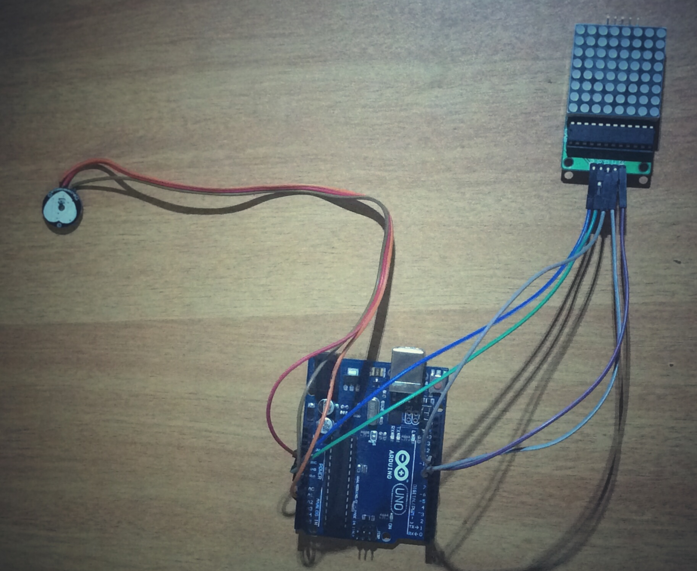
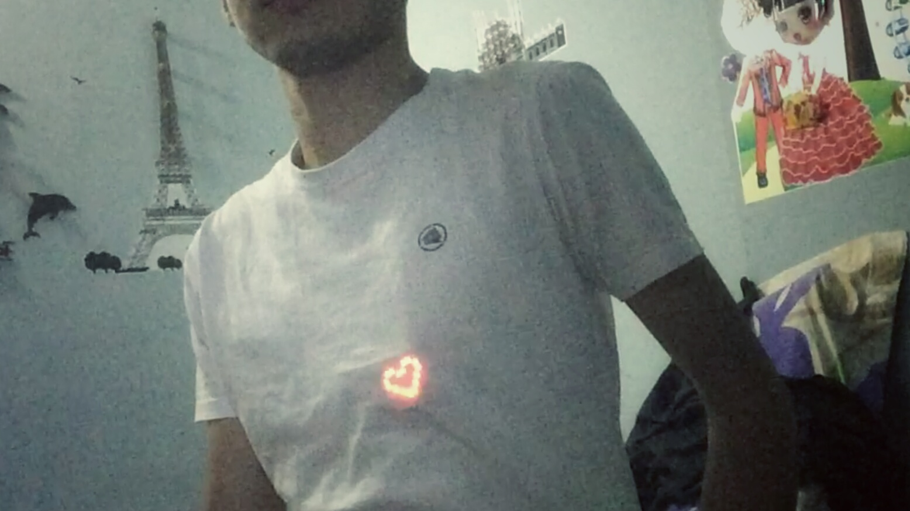

# wearable_heartbeat
This is a demonstration of wearable technology using arduino. 

# Description
Build this fun project/circuit to show the rythm of your beating heart using your own wearable electronic platform. 

# Components
<ol>
  <li>Arduino (We are using Arduino Uno Board, but you can use any Arduino (compatible) board)</li>
  <li>Pulse Sensor (pulsesensor.com) <a href ="http://pulsesensor.com">Buy Here</a></li>
  <li>8 X 8 LED Matrix </br>
  
  (You can find the matrix module at many online stores (<a href="http://dx.com/p/max7219-dot-matrix-module-w-5-dupont-lines-184854">Buy Here </a>))
  </br>This includes a 8x8 LED matrix (red colour), a MAX7219 chip to control the LEDs, header PINs and sockets, one 10KOhm resistor, a 100nF capacitor, a 10uF electrolic capacitor and a PCB where everything is connected together. You can purchase the module already soldered and mounted
  </li>
  <li>Jumper Wires</li>
</ol>

# Dependencies
This project requires **LEDControl** Arduino Library. 
To install the library in your Arduino IDE:
- uncompress the library file that you just downloaded
- make sure that you close all the open windows of the Arduino IDE
- look for the libraries folder inside the folder where you installed the Arduino IDE
- copy the uncompressed LedControlMS folder (the folder with all its content)  inside the libraries folder

If everything worked fine, you should be able to ```#include "LedControlMS.h"```

<a href="http://www.instructables.com/files/orig/F79/UC7X/HKCJMPGV/F79UC7XHKCJMPGV.zip"> Download the LEDControl ZIP here </a>

<a href="http://www.instructables.com/id/LED-Matrix-with-Arduino/?ALLSTEPS">More tutorial on 8 X 8 Matrix</a>

# Wiring

<ul>
  <li>Connecing 8 X 8 Matrix Module to Arduino</li>
                    | LED Matrix    |        Arduino|
                    | ------------- |:-------------:|
                    | VCC           |             5V|
                    GND                       GND
                    DIN                       D12
                    CS                        D10
                    CLK                       D11
<ul>
# Final Output


#Video
